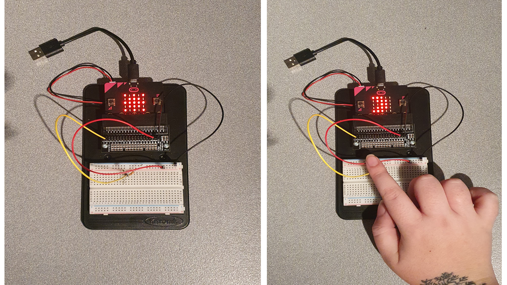

# Inventor Kit Experiments

*Markdown reference: https://guides.github.com/features/mastering-markdown/*

## Instructions ##

*For a selection of 5 inventor kit experiments that you choose, fill out the following sections.

### USING A LIGHT SENSOR & ANALOG INPUTS ###

The point of this experiment is to get the Micro:bit to recognise lighting over and under 200. When it is over, it will use its LEDs to create an image of the sun, and when it is under 200, it will instead use its LEDs to create an image of the moon.

For this experiment, you need;

x3 Male to Female jumper wires.
x1 Phototransistor.
x1 10K Resistor.

#### Photo of completed project ####
*In the code below, replace `missingimage.png` with the name of the image, which should be in the `kitexperiments` folder.*

(My successfully completed project, with photos showing the Microbit responding to light over 200 and light less than 200)

#### Reflection ####

This was the first experiment in the book that well and truly blew my mind. I found it fun to create and couldn't get over how simple it was to re-create it. The code was basic and the setup was simple, but the results - while they may not seem like a big deal - were pretty awesome. I loved seeing the Microbit respond in real time to the changes in lighting situation with minimal lag. I found one of the challenges of this particular experiment was working with all the inputs being within close proximity of one another, and trying to not get tangled in the cords.

I believe this shows the basic workings of solar panels on outdoor garden lights. They charge via sunlight and then, when the light senses that it's getting dark around, it will turn on to create light. This can also be achieved if you cover the entirety of the solar panel, much how you can trigger the Microbit to show a moon in its LEDS by covering the top of the phototransistor, used in this experiment. 

### DIMMING AN LED USING A POTENTIOMETER ###

The point of this experiment is to control the brightness settings of a red 5MM LED on the solderless breadboard. To play with these settings you are using a pententiometer as a dimmer switch. 

For this experiment, you need the following;

x1 Potentiometer.
x1 Push switch.
x1 Red 5MM LED.
x1 47 Resistor.
x7 Male to Female jumper wires.

#### Photo of completed project ####
In the code below, replace imagemissing.jpg with the name of the image, which should be in the kitexperiments folder.

(Insert a caption here)

#### Reflection ####

In this experiment, the first time I did it, the dimming of the light was incredibly noticeable and mind blowing. However, the second time the dimming wasn't crazy apparent, but it still did what the experiment was meant to do. The setup was decently simple considering the amount of wires, and I enjoyed how interactive this particular experiment was, with the dimming switch and the button to power the LED on and off. Having an experiment this interactive in both the creation and final product was a lot of fun, and made the experience more enjoyable. 

### USING A TRANSISTOR TO DRIVE A MOTOR ###

In this experiment, you use a motor to spin a fan around. Slow at first, then speeds up, before stopping for ten seconds and then starting again. 

For this experiment, you need the following;

x1 Transistor.
x1 2.2k Resistor.
x1 Terminal connector.
x1 Motor.
x3 Male to Female jumper wires.
x1 Fan blade.

#### Photo of completed project ####
In the code below, replace imagemissing.jpg with the name of the image, which should be in the kitexperiments folder.

The following photo shows the movement of the fan. I had to hold the wires to keep them in place inside the terminal connector.

#### Reflection ####

In this experiment I feel like a learned some of the true power and capabilities the Micro:bit has - it's not just something with pretty LED lights, but something that, with the right components, can create things with movement. I really enjoyed this experiment due to using the motor and therefore really wanted to include it in my experiments portfolio. I learned how to create movement with the Micro:bit and how movement doesn't need to be the simplicity of an object moving and not stopping until everything is disconnected. But rather, that a motor, when coded correctly, can follow instruction.

With a bigger fan and bigger motor, this could certainly be used as a typical fan - one to cool the user down. Maybe, if you continue to program the motor to stop every ten seconds, it could stop the user from getting too cold, or even be a more powersavvy option - limiting power consuption and lowering electricity bills. Of course, you could probably run it off a bigger battery, but that seems like a less environmentally conscious option.

### Experiment name ###

(Replace this with the experiment name)

#### Photo of completed project ####
In the code below, replace imagemissing.jpg with the name of the image, which should be in the kitexperiments folder.

(Insert a caption here)

#### Reflection ####

In this experiment, something new to me was or something I learned was (insert something here).

This experiment could be the basis of a real world application such as (insert something here).

### Experiment name ###

(Replace this with the experiment name)

#### Photo of completed project ####
In the code below, replace imagemissing.jpg with the name of the image, which should be in the kitexperiments folder.

(Insert a caption here)

#### Reflection ####

In this experiment, something new to me was or something I learned was (insert something here).

This experiment could be the basis of a real world application such as (insert something here).

