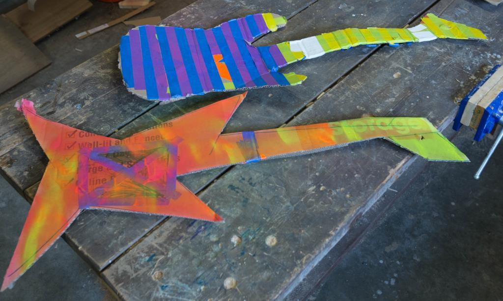
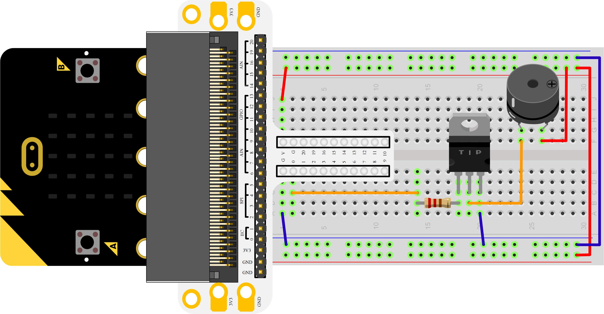
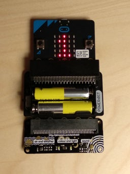
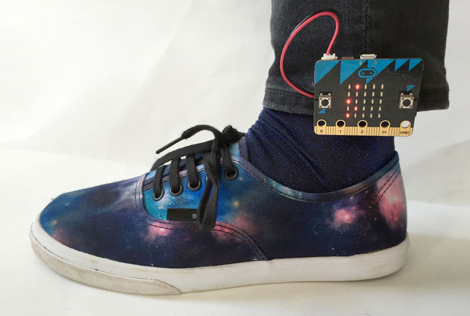
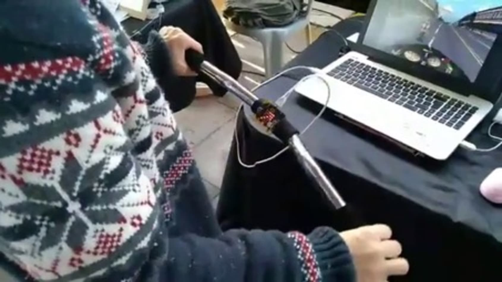
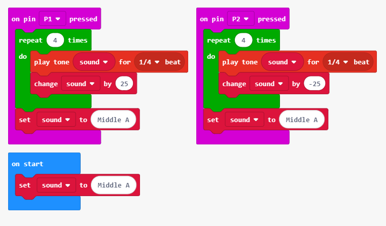
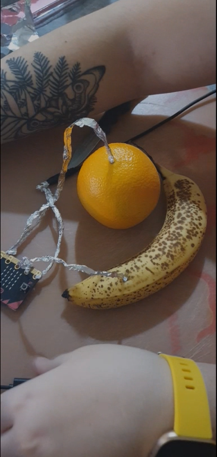
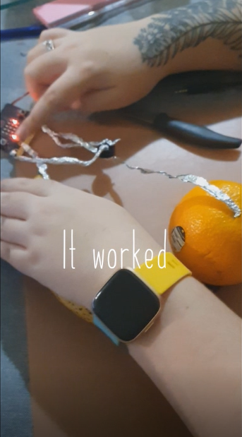

## Replication project ##
#### Banana Keyboard ####

### Related project 1 ###
# Hack Your Headphones #

https://makecode.microbit.org/projects/hack-your-headphones

This project is related to mine because of the intention to create sound in an interesting way using the Micro:Bit. In this experiment there is the similar usage of crocodile clips and a headset that my Banana Keyboard project has. Except that in my final product, I decided to swap out the headphones for a piezo buzzer, so that the sound from the Micro:Bit could be heard in the YouTube video that I uploaded. Otherwise this experiment is pretty much my project, without the banana and orange added as triggers for sound to be made.

### Related project 2 ###
# Guitar #

https://makecode.microbit.org/projects/guitar

Another project that is related to the concept of sound being made through the Micro:bit. I personally would have loved to do this project if I had had the money for the resources, but I didn't and so I went with the banana keyboard concept instead. Much like the two previously mentioned experiments, this experiment needs crocodile clips and a headset in order to work. I feel though however, that this project would be a lot harder to get to function with the aluminium foil replacement that I used in my banana keyboard project. 

### Related project 3 ###
# Buzzer #

In this experiment, posted here; https://www.elecfreaks.com/store/blog/post/microbit-experiment-09buzzer-elecfreaks-mirco-bit-starter-kit-course.html - the purpose is to get the piezo buzzer to make sounds between high and low frequencies, like an alarm. This frequency change can be seen working on the LED screen of the Micro:bit as well. I found this project and decided to include it in my research, as it has to deal with sound including a piezo buzzer, rather than a headset.

### Related project 4 ### 
# Noise Level Detector #

I included this experiment for its relation to sound, but because of the introduction to other hardware outside of using a Micro:bit. It introduces the usage of the **Pimoroni, Enviro:Bit** and the **Pimoroni, Power:Bit**. The microphone on the enviro:bit detects the sound level, and from the resulting value a position on the 5x5 LED matrix is calculated and the corresponding LED is activated. The maximum values measured are stored and remain displayed on the LED matrix. To reset the LED, you press the A button. For more information on this experiment, here is the link; https://www.instructables.com/id/Microbit-Noise-Level-Detector/.

### Related project 5 ###
# Step Counter #

Despite no relation to sound I decided to include this experiment as a related project, as it has to do with sensing movement/pressure. It is simple to make and doesn't require too many extra parts, but it's something that is practical to use, and can become creative - as you can choose whether or not to make it more aesthetically pleasing for your own personal use. Admittedly, you can just use an app on your phone or smart watch; but this seems way cooler. The link to the experiment can be found here; https://make.techwillsaveus.com/microbit/activities/step-counter-by-the-faraday-institute

### Related project 6 ###
# Motorbike Simulator #

I'm including this one not only because it looks cool, but because I feel it relates to my project due to the use of odd objects. My project uses fruit. With electronics. Which is a bit odd in my opinion, but then again, so is using handlebars for a simulator. I also feel like that this might be a project I would like to try and carry out for myself one day, as it seems like a cool project to show off. Unfortunately, the link for the experiment is gone, but you can see the image and story of its creation on this website; https://www.itpro.co.uk/desktop-hardware/26289/13-top-bbc-micro-bit-projects.

## Reading reflections ##
*Reflective reading is an important part of actually making your reading worthwhile. Don't just read the words to understand what they say: read to see how the ideas in the text fit with and potentially change your existing knowledge and maybe even conceptual frameworks. We assume you can basically figure out what the readings mean, but the more important process is to understand how that changes what you think, particularly in the context of your project.*

*For each of the assigned readings, answer the questions below.*

### Reading: Don Norman, The Design of Everyday Things, Chapter 1 (The Psychopathology of Everyday Things) ###

*What I thought before:* before reading **The Design of Everyday Things** I had the belief that affordances were clear things that were the advertised purpose of an object, for example, the advertised affordance of a chair being that you can **sit on the chair**. Not that there are hidden affordances to every object that can be temporary and dependant on the user. Such affordances being that the chair can be used to **stand on to reach high places** or that the chair can be **easily lifted for portability**.

*What I learned:* That there is a difference between the intended purpose of an object, and how to achieve said intended purpose. I thought that both of these branches of information were considered **affordances**, and while designers may feel comfortable still using the term **affordances** for both the intention and achieveability of a purpose, a better term for actively instructing a user, whether this be via tutorial, instruction manual, or an arrow and description, is the word **signifier**. Sometimes, **signifiers** can be the opposite of the original intention, or an accident created by a third-party.

*What I would like to know more about:* While this chapter talks about the need to make clear your design intention when considering the affordances and signifiers of the product, and how some of the pictured objects could have clearer intentions, I feel it would be even more beneficial to note how one can think more openly about the possible miscommunication in their design ideas. How to make sure that your design planning is structured enough to take into account the possible affordances that can make and break their product for certain audiences.

*How this relates to the project I am working on:* With the banana keyboard, it can be easily misconstrued that all is needed is a banana, via the title. Audiences who have a tendency to skim read, even over instructions, may miss the fact that an orange is also needed to carry out the project. In fact, this is a mistake I made. I asked my mother in law to buy bananas during a shopping trip and was ready to begin carrying out my experiment, only to thoroughly read the instructions and realise I also needed an orange. Luckily, I was able to quickly rectify this error. But others might not be as lucky as I. 

### Reading: Chapter 1 of Dan Saffer, Microinteractions: Designing with Details, Chapter 1 ###

*What I thought before:* before reading this it was easy for me to take microinteractions for granted. Little things like volume buttons and auto-fill on web forms. It is easy to take these things for granted because they're used without much thought. I do not consider what it would be like to not have a certain feature on my phone. This article put into question my beliefs on whether or not a phones capabilities are fully fleshed out for each individual user - for example; should there be a notification on iPhones that when you silence your phones, that your alarms will not also be silenced? Should there be an option to quickly shut off all alarms?

*What I learned:* I learned that a lot of microinteractions are created from trial and error in previous models. Sometimes mistakes have to be made in order to create something that is truly brilliant. Microinteractions come in the form of a website guessing your name based off of your email, or a website telling you the strength of your password. But, despite the name of the term having the word *micro* in it, that doesn't mean it has to be one little thing. A Microinteraction can be big, or even the entire point of a singular product. As long as things aren't over complicated and it is dedicated to a task. Such as a toaster - the entire product has one capability. It toasts. In that way, it is considered a Microinteraction. 

*What I would like to know more about:* I want to know whether it is possible for a Microinteraction to become something that is so much bigger and better. When do we accept that maybe, a Microinteraction is no longer a microinteraction, instead of being a microinteraction with a plethora of affordances?

*How this relates to the project I am working on:* The banana keyboard would be considered a product that in itself is a Microinteraction, due to the matter of it only being useful for one thing - it is made with the purpose to create/make a sound. However, once you remove the Micro:Bit, making the Micro:Bit and Banana Keyboard setup separate entities once more, it is no longer a Microinteraction.

### Reading: Scott Sullivan, Prototyping Interactive Objects ###

*What I thought before:* That the purpose of a prototype is to promote an idea to individuals who may be interested. But a small portion of prototyping is actually about promotion and more about learning about what can be done to improve your project before it does get taken further - whether being taken further means being put on the market, or before the idea becomes accessible for others to use.

*What I learned:* I learned that in experiments, appearance can certainly matter. As the general population might become unsettled by what looks like a bunch of wires strapped to an object, hidden and out of site. They might think it is a bomb. My thought on this part of the article is that if you do not give an accurate appearance to a project, it may be misconstrued as something else and ruin the experience/experiment for yourself, or the user/intended audience.

*What I would like to know more about:* I want to learn more about Arduino. It looks similar to the Micro:Bit in some respects but is obviously a completely different type of product. I would like to learn how to use one, and what they're primarily used for. Another thing I would like to learn how to use is the Raspberry Pi. 

*How this relates to the project I am working on:* while appearance doesn't really come into play with my banana keyboard, if I was to prototype it I would have to disclose that the aluminium foil, in place of crocodile clips, was just a design choice for the early stages of my experiment. As the use of foil is quite juvenile and might make my product be taken a lot less seriously than intended. But then again...it's a banana that makes noises. 

## Interaction flowchart ##

## Process documentation

For the sake of this experiment I had to buy a banana and an orange, which kind of sucked because I don't eat either of those fruits, so they kind of had to go to waste. If this experiment had to deal with mangoes, there wouldn't have been an issue. Maybe someone should create a Mango keyboard.

Another issue I had is that at the time, I didn't have access to Crocodile clips. I hadn't been able to afford them and it was really difficult to go out and buy them. Thanks Corona. 

So in place of crocodile clips, due to a fun little fact posted on the MakeCode website, I was able to use aluminium foil instead. It was harder to work with due to having to make it thin like a wire, but also making it strong enough to hold position inside of a fruit.

In the following video that I uploaded to YouTube, I show how I went about making the project. Due to the lack of crocodile clips, I also had to use a knife to make holes in the fruits for the aluminium foil to go into, because as you are well aware, aluminium foil isn't exactly sharp. 

https://www.youtube.com/watch?v=b69ccWVaTV4&t=19s

I made sure to use a cutting board as well for the experiment, as I feared due to the fruit, it would become messy.

I decided on this experiment over the others, as I felt this would be the easiest experiment to carry out on my low budget.

The code was easy enough to replicate and I found myself having no issues getting the code to function. The hardest part was making the experiment and I fear any issues I had were purely due to my use of aluminium foil.

Below is a screenshot of the code I use;

## Project outcome ##

SUCCESS!

### Project title ###

Banana Keyboard

### Project description ###

In this experiment, you are to make a banana keyboard. What you will need is a Micro:bit, a battery pack, some crocodile clips, a banana and an orange. With these items you should be able to eventually tap the banana to make a sound. It is up to you whether you use headphones, or a piezo buzzer to get the sound to come out clear.

### Showcase image ###

### Additional view ###

This is the closest image I have to show what the experiment can look like, if worked on correctly. 

### Reflection ###

The most successful part of my experiment was simply that it worked. I wish I had proper crocodile clips to carry out the experiment, and it is definitely something to consider for my future project. I am just extremely grateful that there was a way to do the experiment without them, otherwise I would have had an issue, due to my lack of funds.

I thought the project was super interesting to create due to its simplicity and whimsicality. I have the urge to use some of the elements of the experiment, and maybe with the use of bluetooth, maybe I would have the ability to make a literal banana phone - however I would have to do a lot more research for the project to carry it out. But it might be something I work on in my free time, if I'm feeling creative.
